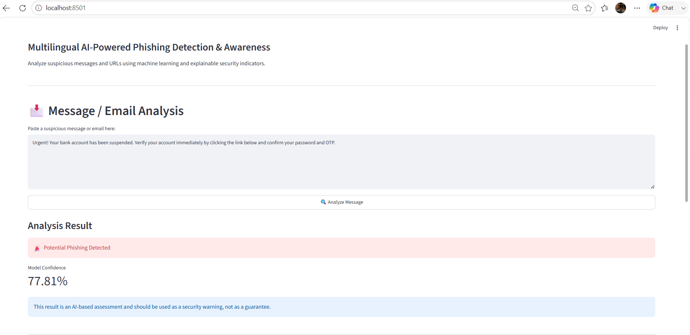
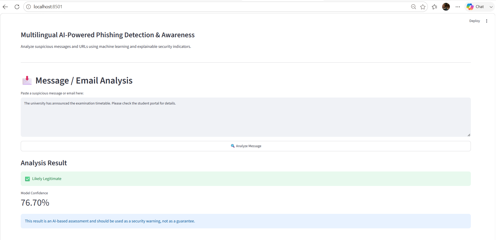
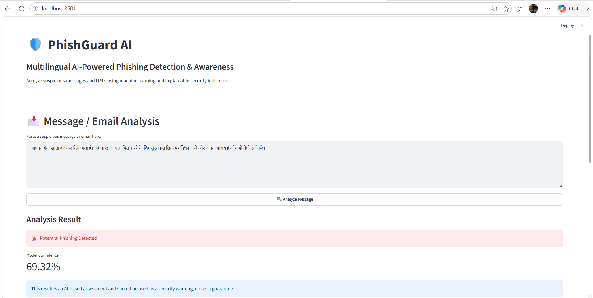
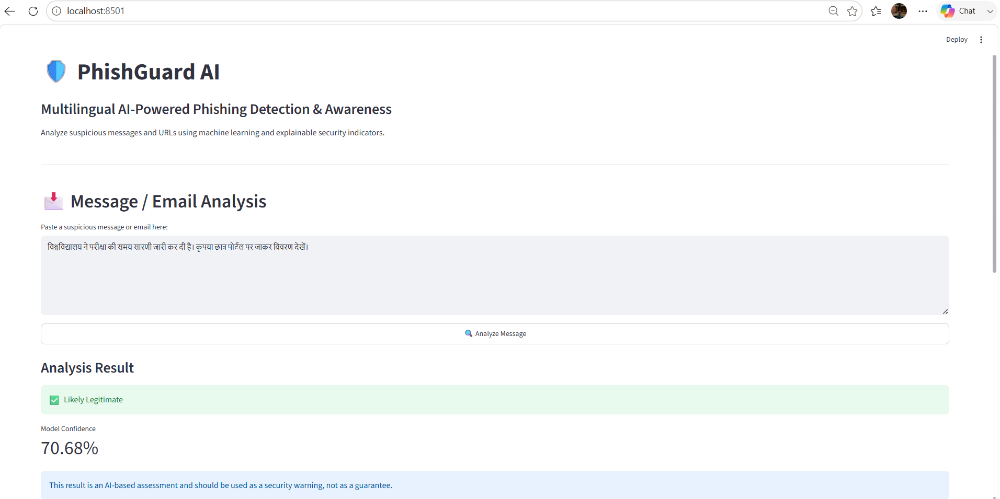
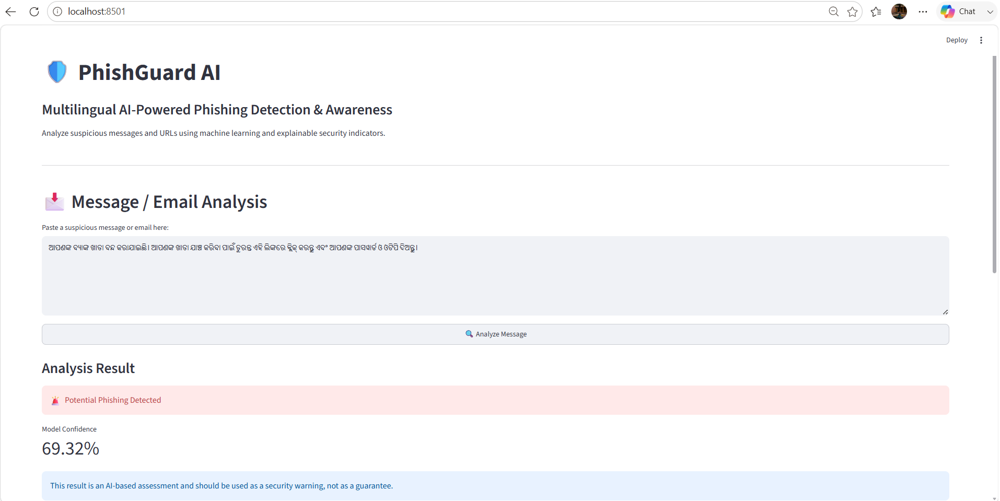
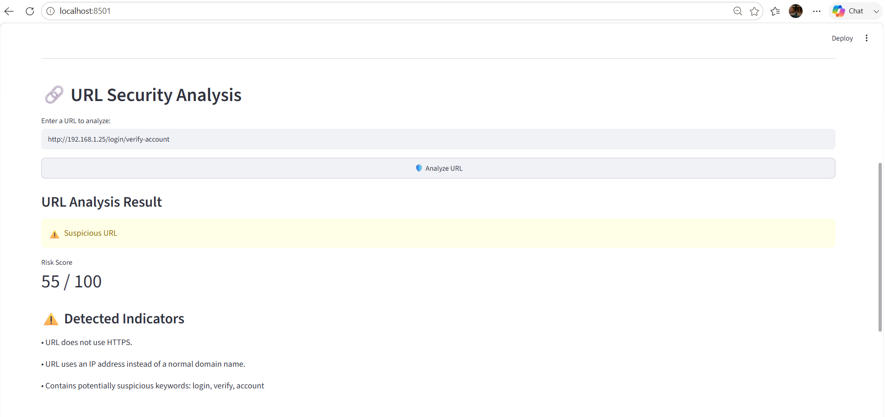

# 🛡️ PhishGuard AI

## Multilingual AI-Powered Phishing Detection & Awareness

PhishGuard AI is an AI-assisted cybersecurity application designed to help users identify potentially malicious messages, emails, and URLs.

The system combines a trained machine-learning model with multilingual phishing indicators and explainable URL security checks to provide understandable phishing-risk assessments.

> ⚠️ **Disclaimer:** PhishGuard AI provides an AI-based security assessment and should be used as a warning mechanism, not as a guarantee of safety.

---

## 🚨 Problem Statement

Phishing attacks use deceptive emails, messages, and websites to trick users into revealing sensitive information such as passwords, OTPs, banking details, and personal data.

The problem becomes more challenging when phishing messages are written in regional languages, especially for users who may not be comfortable identifying common cybersecurity warning signs.

PhishGuard AI addresses this problem by combining machine-learning-based message classification with multilingual security indicators and explainable URL analysis.

---

## 💡 Solution

PhishGuard AI provides two primary security analysis features.

### 📩 Message / Email Analysis

Users can paste a suspicious message or email into the application.

The system:

* Analyzes the message using a trained machine-learning model.
* Identifies potential phishing patterns.
* Supports additional phishing indicators for English, Hindi, and Odia.
* Produces a phishing or legitimate assessment.
* Displays a confidence score.
* Provides a security warning to help users make safer decisions.

### 🔗 URL Security Analysis

Users can enter a URL for security analysis.

The system checks for suspicious characteristics such as:

* Missing HTTPS
* IP addresses instead of normal domain names
* Suspicious keywords
* Login-related terminology
* Account verification terminology
* Other potentially risky URL characteristics

A risk score from **0 to 100** is displayed along with detected security indicators.

---

## 🌍 Multilingual Detection

PhishGuard AI includes a multilingual security layer for:

* 🇬🇧 English
* 🇮🇳 Hindi
* 🟠 Odia

The multilingual layer identifies common phishing-related indicators such as:

* Account verification requests
* Urgent actions
* Password requests
* OTP-related requests
* Banking references
* Suspicious links
* Account suspension warnings
* Prize and reward scams

The multilingual security layer works together with the trained machine-learning model to provide an additional phishing-risk signal.

---

## 🧠 How It Works

```text
                    ┌─────────────────────┐
                    │      User Input     │
                    └──────────┬──────────┘
                               │
                 ┌─────────────┴─────────────┐
                 │                           │
                 ▼                           ▼
        📩 Message / Email             🔗 URL Input
                 │                           │
                 ▼                           ▼
       Machine Learning Model         URL Security Analyzer
                 │                           │
                 ▼                           ▼
       Multilingual Security          Suspicious Indicator
            Analysis                       Detection
                 │                           │
                 └─────────────┬─────────────┘
                               │
                               ▼
                    🛡️ Risk Assessment
                               │
                ┌──────────────┴──────────────┐
                │                             │
                ▼                             ▼
       🚨 Potential Phishing          ✅ Likely Legitimate
                │
                ▼
        Confidence / Risk Score
                │
                ▼
        Explainable Warning
```

---

## 🛠️ Tech Stack

### Programming Language

* Python

### Machine Learning

* Scikit-learn
* Joblib

### Web Application

* Streamlit

### Security Analysis

* URL parsing
* Rule-based phishing indicators
* Multilingual keyword analysis
* Machine-learning-based classification

### Development Tools

* Visual Studio Code
* Git
* GitHub

---

## 📂 Project Structure

```text
PhishGuard-AI/
│
├── app.py
│   └── Streamlit application interface
│
├── predictor.py
│   └── Machine-learning and multilingual message analysis
│
├── url_analyzer.py
│   └── URL security and risk analysis
│
├── train_model.py
│   └── Model training script
│
├── data/
│   └── phishing_dataset.csv
│
├── models/
│   └── phishing_model.joblib
│
├── screenshots/
│   ├── english_phishing.png
│   ├── english_legitimate.png
│   ├── hindi_phishing.png
│   ├── hindi_legitimate.png
│   ├── odia_phishing.png
│   └── url_analysis.png
│
├── requirements.txt
└── README.md
```

---

## 📸 Application Screenshots

### 🚨 English Phishing Detection

PhishGuard AI identifies a suspicious English message as a potential phishing attempt.



---

### ✅ English Legitimate Message

A normal university-related message is classified as likely legitimate.



---

### 🇮🇳 Hindi Phishing Detection

The multilingual security layer detects phishing indicators in a Hindi message.



---

### 🇮🇳 Hindi Legitimate Message

A normal Hindi university announcement is classified as likely legitimate.



---

### 🟠 Odia Phishing Detection

PhishGuard AI detects phishing indicators in an Odia message.



---

### 🔗 URL Security Analysis

The URL analyzer identifies suspicious characteristics and provides a risk score with explainable security indicators.



---

## 🧪 Example Test Results

### English Phishing Message

**Result:** 🚨 Potential Phishing Detected

**Model Confidence:** 63.63%

---

### English Legitimate Message

**Result:** ✅ Likely Legitimate

**Model Confidence:** 61.17%

---

### Hindi Phishing Message

**Result:** 🚨 Potential Phishing Detected

**Model Confidence:** 69.32%

---

### Odia Phishing Message

**Result:** 🚨 Potential Phishing Detected

**Model Confidence:** 69.32%

---

### Hindi Legitimate Message

**Result:** ✅ Likely Legitimate

**Model Confidence:** 70.68%

---

### Example Suspicious URL

**Risk Score:** 55 / 100

Detected indicators included:

* URL does not use HTTPS.
* URL uses an IP address instead of a normal domain name.
* Suspicious keywords such as `login`, `verify`, and `account`.

---

## 🎯 Key Features

| Feature                            | Status |
| ---------------------------------- | ------ |
| 📩 Message analysis                | ✅      |
| 🤖 ML-based phishing detection     | ✅      |
| 🇬🇧 English detection             | ✅      |
| 🇮🇳 Hindi detection               | ✅      |
| 🟠 Odia detection                  | ✅      |
| 🔗 URL analysis                    | ✅      |
| ⚠️ URL risk scoring                | ✅      |
| 🔍 Explainable security indicators | ✅      |
| 🛡️ Security recommendations       | ✅      |
| 🖥️ Streamlit interface            | ✅      |

---

## 🔐 Safety Recommendations

PhishGuard AI provides basic cybersecurity awareness recommendations:

* Do not click suspicious links.
* Never share passwords, OTPs, PINs, or banking details.
* Verify the sender through an official communication channel.
* Carefully check website addresses before entering information.
* Be cautious of urgent threats, unexpected rewards, and unusual requests.

---

## ▶️ How to Run

### 1. Clone the repository

```bash
git clone https://github.com/SmrutiSurekhaPati-hub/PhishGuard-AI.git
```

### 2. Open the project

```bash
cd PhishGuard-AI
```

### 3. Create a virtual environment

```bash
python -m venv venv
```

### 4. Activate the virtual environment

On Windows CMD:

```bash
venv\Scripts\activate
```

### 5. Install dependencies

```bash
python -m pip install -r requirements.txt
```

### 6. Run the application

```bash
python -m streamlit run app.py
```

The application will open at:

```text
http://localhost:8501
```

---

## 🌟 Why PhishGuard AI?

PhishGuard AI is designed not only to classify suspicious content but also to improve **user awareness**.

Instead of providing only a binary prediction, the application presents understandable security warnings and indicators that can help users recognize common phishing techniques.

The multilingual component makes the concept more accessible to users who receive suspicious communications in languages other than English.

---

## 🚀 Future Improvements

Potential future enhancements include:

* Support for additional Indian and international languages.
* Transformer-based multilingual language models.
* Real-time URL reputation checking.
* QR-code phishing detection.
* Browser extension integration.
* SMS and messaging-platform integration.
* Improved phishing datasets with multilingual samples.
* Advanced explainable AI visualizations.
* Continuous model retraining using new phishing examples.

---

## 🏆 Hackathon Project

**Project:** PhishGuard AI

**Event:** Omnikon National Hackathon 2026

**Problem Statement:** `Omni_CyberTech_1`

Built as a cybersecurity-focused prototype for phishing detection and user awareness.

---

## ⚠️ Disclaimer

PhishGuard AI is an educational and prototype cybersecurity project.

Its predictions and risk scores are not guaranteed to identify every phishing attempt. Users should independently verify suspicious communications and avoid sharing sensitive information with untrusted sources.

---

## 👩‍💻 Author

**Smruti Surekha Pati**

B.Tech Computer Science Engineering (Data Science)

GitHub: https://github.com/SmrutiSurekhaPati-hub
